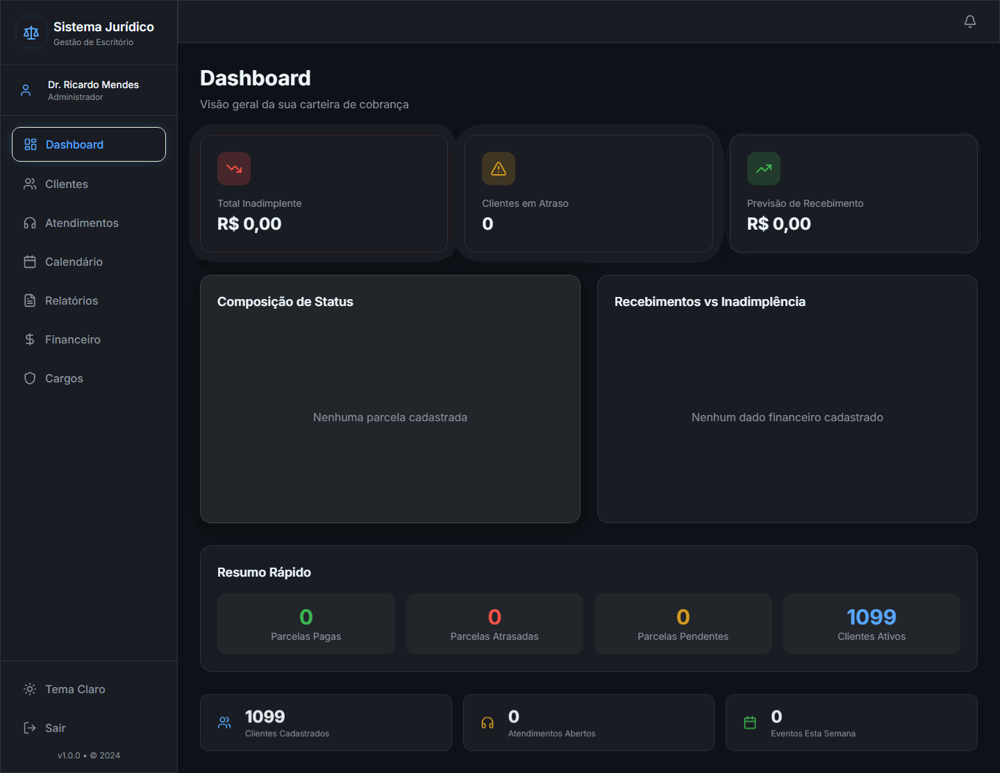
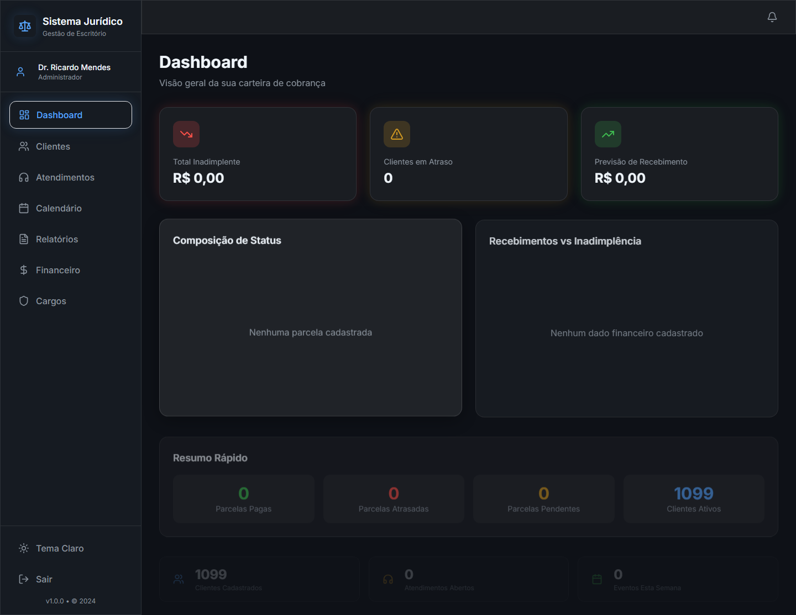
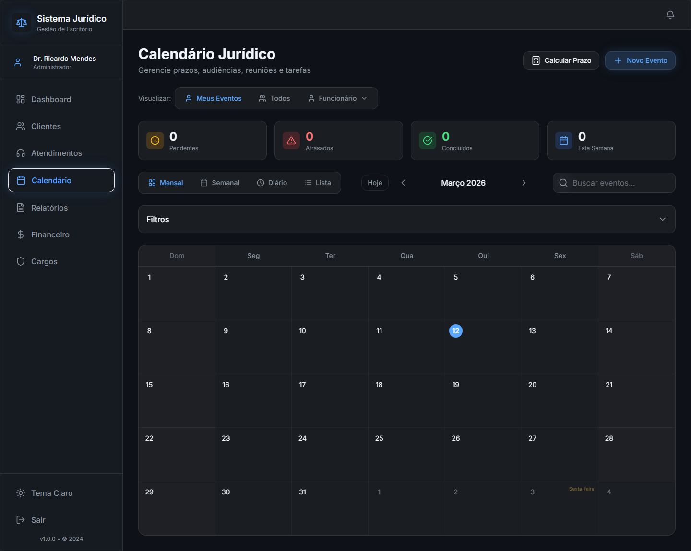

# CRM Escritório Jurídico

Sistema web para gestão de escritório jurídico com foco em produtividade operacional, controle de clientes, atendimentos, agenda jurídica, financeiro e permissões por perfil.


## Sumário

- Visão Geral
- Principais Funcionalidades
- Tecnologias
- Estrutura do Projeto
- Requisitos
- Instalação
- Configuração de Ambiente
- Executando o Projeto
- Segurança e LGPD
- Importação de Contatos (CSV/XLSX)
- Scripts Disponíveis
- Roadmap
- Contribuição
- Licença

## Visão Geral

O CRM foi pensado para o fluxo real de um escritório jurídico:

- Gestão completa de clientes com cadastro detalhado.
- Gestão de atendimentos com histórico e acompanhamento.
- Calendário jurídico com filtros por responsável, tipo e status.
- Módulo financeiro para cobranças, parcelas e acompanhamento.
- Administração de usuários com cargos e permissões customizáveis.

## Preview Visual

### GIF de Navegação



### Tela Inicial



### Calendário Jurídico



## Ícones por Módulo

- 🧑‍💼 Clientes
- 📞 Atendimentos
- 🗓️ Calendário Jurídico
- 💰 Financeiro
- 🛡️ Segurança e LGPD
- ⚙️ Administração e Permissões

## Principais Funcionalidades

### Clientes

- Cadastro, edição, visualização e desativação de clientes.
- Busca global por nome e CPF/CNPJ.
- Filtros por status e estado.
- Importação de contatos via CSV, XLS e XLSX.
- Auto preenchimento de endereço por CEP (ViaCEP).

### Atendimentos

- Registro de atendimentos por cliente.
- Status de funil e acompanhamento de evolução.
- Histórico de interações e observações.

### Calendário Jurídico

- Visualizações mensal, semanal, diária e em lista.
- Filtro por responsável, cliente, processo, status e tipo.
- Controle de prazos e eventos.

### Financeiro

- Gestão de cobranças e parcelas.
- Marcação de pagamentos.
- Histórico de comunicação (WhatsApp) vinculado ao cliente.

### Administração e Permissões

- Gestão de usuários e papéis.
- Permissões por cargo com edição flexível.
- Persistência local de permissões customizadas.

## Tecnologias

- React 18
- TypeScript
- Vite
- Tailwind CSS
- Lucide Icons
- Recharts
- jsPDF
- xlsx

## Estrutura do Projeto

```text
src/
	components/      # Componentes reutilizáveis
	context/         # Providers e estado global
	data/            # Dados mock/iniciais
	pages/           # Páginas principais
	types/           # Tipagens TypeScript
	utils/           # Utilitários, segurança e regras
```

## Requisitos

- Node.js 18+
- npm 9+

## Instalação

```bash
npm install
```

## Configuração de Ambiente

1. Crie o arquivo `.env` a partir do exemplo:

```bash
# Linux / macOS
cp .env.example .env

# Windows (PowerShell)
Copy-Item .env.example .env
```

2. Preencha as variáveis conforme seu ambiente:

```env
VITE_API_BASE_URL=
VITE_VIA_CEP_API_BASE_URL=https://viacep.com.br/ws
VITE_FINANCIAL_API_KEY=
VITE_FINANCIAL_CLIENT_ID=
VITE_SENSITIVE_ENCRYPTION_KEY=
```

## Executando o Projeto

### Desenvolvimento

```bash
npm run dev
```

### Build de produção

```bash
npm run build
```

### Preview local da build

```bash
npm run preview
```

## Segurança e LGPD

Este projeto já possui uma base de proteção para evitar exposição acidental:

- Segregação de chaves e credenciais via variáveis de ambiente.
- Arquivo `.gitignore` reforçado para bloquear arquivos sensíveis.
- Utilitários de sanitização para payloads de API.
- Helpers de criptografia para dados financeiros sensíveis.

Boas práticas recomendadas para produção:

- Nunca commitar `.env` com credenciais reais.
- Armazenar dados financeiros criptografados no backend.
- Rotacionar chaves periodicamente.
- Auditar logs para evitar vazamento de PII.

## Importação de Contatos (CSV/XLSX)

Na tela de clientes, o botão de importação aceita:

- `.csv`
- `.xls`
- `.xlsx`

Mapeamentos comuns de colunas são tratados automaticamente (nome, documento, telefone, email, endereço, etc).

## Scripts Disponíveis

- `npm run dev`: inicia o servidor de desenvolvimento.
- `npm run build`: gera a build de produção.
- `npm run preview`: executa preview da build.
- `npm run lint`: roda análise estática com ESLint.

## Roadmap

- Integração com backend/API real.
- Auditoria de eventos sensíveis.
- Controle de sessão e política de expiração de token.
- Criptografia ponta a ponta para dados de maior criticidade.
- Testes automatizados (unitários e integração).

## Contribuição

1. Faça um fork do projeto.
2. Crie uma branch de feature.
3. Commit suas alterações.
4. Abra um Pull Request com descrição clara.

## Licença

Definir licença oficial do projeto (sugestão: MIT para uso amplo, ou licença proprietária para uso interno do escritório).
